```python
DB_DICTIONARY = {
    "dashboard": {
        "description": "대시보드 요약/집계 데이터",
        "fields": {
            "summary": "dict",
            "top_products": "list[dict]",
            "recent_transactions": "list[dict]",
            "platform_sales": "list[dict]",
            "purchase_order_summary": "dict",
            "sales_import_summary": "dict",
        },
    },

    "products": {
        "description": "상품 마스터",
        "fields": {
            "id": "int",
            "sku": "str",
            "name": "str",
            "category": "str",
            "supplier_name": "str",
            "current_stock": "int",
            "available_stock": "int",
            "unit": "str",
            "status": "str",
            "created_at": "date",
        },
    },

    "suppliers": {
        "description": "공급사 마스터",
        "fields": {
            "id": "int",
            "name": "str",
            "manager_name": "str",
            "phone": "str",
            "email": "str",
            "categories": "list[str]",
            "payment_term": "str",
            "status": "str",
            "created_at": "date",
        },
    },

    "supplier_prices": {
        "description": "공급사별 상품 매입가",
        "fields": {
            "id": "int",
            "sku": "str",
            "product_name": "str",
            "supplier_name": "str",
            "moq": "int",
            "purchase_price": "int",
            "vat_rate": "int",
            "total_price": "int",
            "start_date": "date",
            "end_date": "date | None",
            "status": "str",
        },
    },

    "platforms": {
        "description": "판매 플랫폼 마스터",
        "fields": {
            "id": "int",
            "name": "str",
            "code": "str",
            "type": "str",
            "integration_type": "str",
            "fee_rate": "float",
            "status": "str",
            "created_at": "date",
        },
    },

    "platform_prices": {
        "description": "플랫폼별 상품 판매가",
        "fields": {
            "id": "int",
            "sku": "str",
            "product_name": "str",
            "platform_name": "str",
            "platform_icon": "str",
            "selling_price": "int",
            "discounted_price": "int",
            "discount_rate": "int",
            "discount_start_date": "date",
            "discount_end_date": "date",
            "status": "str",
            "updated_at": "datetime",
        },
    },

    "inventory": {
        "description": "현재 재고",
        "fields": {
            "id": "int",
            "sku": "str",
            "product_name": "str",
            "platform_icon": "str",
            "total_stock": "int",
            "available_stock": "int",
            "reserved_stock": "int",
            "inbound_expected": "int",
            "inventory_value": "int",
            "safety_stock": "int",
            "status": "str",
            "location": "str",
        },
    },

    "inventory_transactions": {
        "description": "재고 입고/출고/조정 이력",
        "fields": {
            "id": "int",
            "occurred_at": "datetime",
            "type": "str",
            "ref_no": "str",
            "sku": "str",
            "product_name": "str",
            "location": "str",
            "inbound_qty": "int | None",
            "outbound_qty": "int | None",
            "adjust_qty": "int | None",
            "stock_after": "int",
            "unit_price": "int",
            "amount": "int",
            "note": "str",
            "manager": "str",
        },
    },

    "inventory_snapshots": {
        "description": "일자별 재고 스냅샷",
        "fields": {
            "id": "int",
            "snapshot_date": "date",
            "sku": "str",
            "product_name": "str",
            "opening_stock": "int",
            "inbound_qty": "int",
            "outbound_qty": "int",
            "adjust_qty": "int",
            "closing_stock": "int",
            "inventory_value": "int",
            "location": "str",
            "created_at": "datetime",
        },
    },

    "sales_orders": {
        "description": "판매 주문 이력",
        "fields": {
            "id": "int",
            "ordered_at": "datetime",
            "platform_icon": "str",
            "order_no": "str",
            "product_name": "str",
            "sku": "str",
            "quantity": "int",
            "sales_amount": "int",
            "delivery_type": "str",
            "order_status": "str",
            "settlement_status": "str",
        },
    },

    "sales_imports": {
        "description": "판매 데이터 수집 이력",
        "fields": {
            "id": "int",
            "import_type": "str",
            "platform_name": "str",
            "source": "str",
            "row_count": "int",
            "status": "str",
            "imported_at": "datetime",
        },
    },

    "purchase_orders": {
        "description": "발주 이력",
        "fields": {
            "id": "int",
            "order_no": "str",
            "supplier_name": "str",
            "order_date": "date",
            "expected_date": "date",
            "status": "str",
            "item_count": "int",
            "total_quantity": "int",
            "total_amount": "int",
            "manager": "str",
        },
    },
}
```

```mermaid
erDiagram
    DASHBOARD {
        dict summary
        list top_products
        list recent_transactions
        list platform_sales
        dict purchase_order_summary
        dict sales_import_summary
    }

    PRODUCTS {
        int id
        string sku
        string name
        string category
        string supplier_name
        int current_stock
        int available_stock
        string unit
        string status
        date created_at
    }

    SUPPLIERS {
        int id
        string name
        string manager_name
        string phone
        string email
        list categories
        string payment_term
        string status
        date created_at
    }

    SUPPLIER_PRICES {
        int id
        string sku
        string product_name
        string supplier_name
        int moq
        int purchase_price
        int vat_rate
        int total_price
        date start_date
        date end_date
        string status
    }

    PLATFORMS {
        int id
        string name
        string code
        string type
        string integration_type
        float fee_rate
        string status
        date created_at
    }

    PLATFORM_PRICES {
        int id
        string sku
        string product_name
        string platform_name
        string platform_icon
        int selling_price
        int discounted_price
        int discount_rate
        date discount_start_date
        date discount_end_date
        string status
        datetime updated_at
    }

    INVENTORY {
        int id
        string sku
        string product_name
        string platform_icon
        int total_stock
        int available_stock
        int reserved_stock
        int inbound_expected
        int inventory_value
        int safety_stock
        string status
        string location
    }

    INVENTORY_TRANSACTIONS {
        int id
        datetime occurred_at
        string type
        string ref_no
        string sku
        string product_name
        string location
        int inbound_qty
        int outbound_qty
        int adjust_qty
        int stock_after
        int unit_price
        int amount
        string note
        string manager
    }

    INVENTORY_SNAPSHOTS {
        int id
        date snapshot_date
        string sku
        string product_name
        int opening_stock
        int inbound_qty
        int outbound_qty
        int adjust_qty
        int closing_stock
        int inventory_value
        string location
        datetime created_at
    }

    SALES_ORDERS {
        int id
        datetime ordered_at
        string platform_icon
        string order_no
        string product_name
        string sku
        int quantity
        int sales_amount
        string delivery_type
        string order_status
        string settlement_status
    }

    SALES_IMPORTS {
        int id
        string import_type
        string platform_name
        string source
        int row_count
        string status
        datetime imported_at
    }

    PURCHASE_ORDERS {
        int id
        string order_no
        string supplier_name
        date order_date
        date expected_date
        string status
        int item_count
        int total_quantity
        int total_amount
        string manager
    }
```


