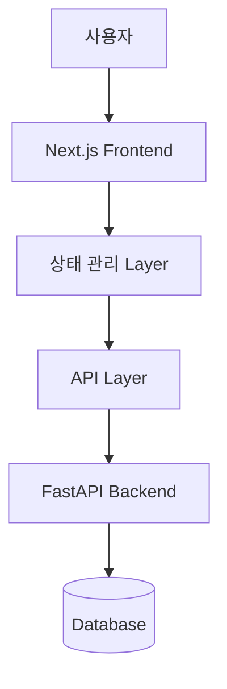
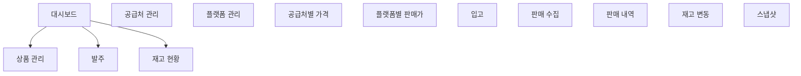
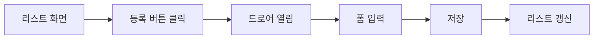
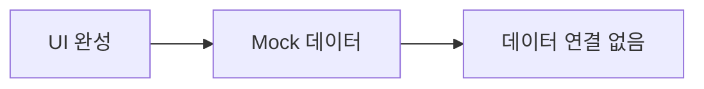
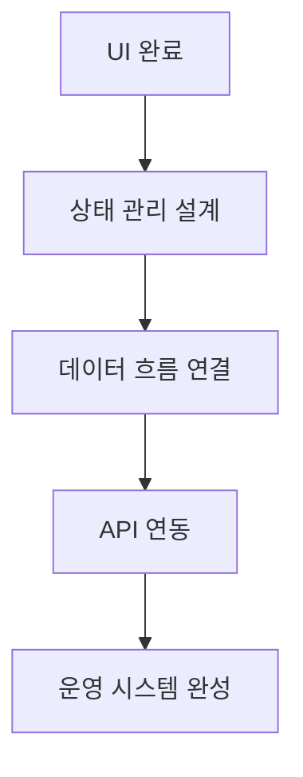
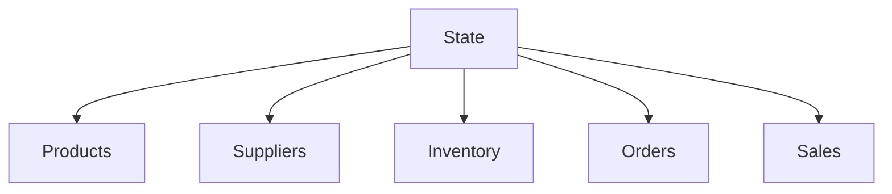
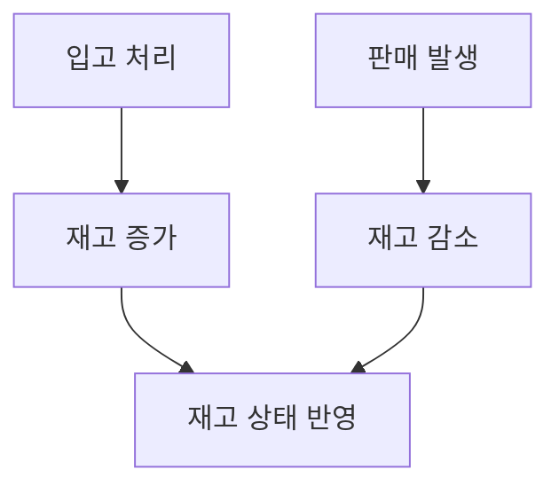
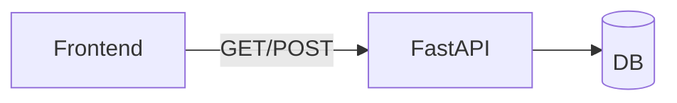
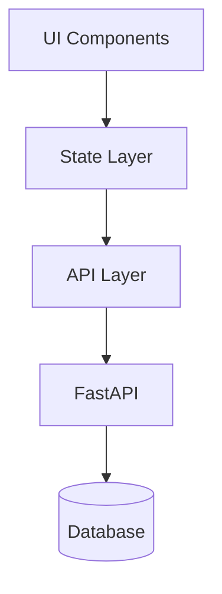

# 📘 SkinNote OPS Frontend 구조 및 개발 진행 문서

---

# 1. 개요

SkinNote OPS Frontend는 **재고관리 운영 시스템의 사용자 인터페이스(UI)**를 담당하며,
상품/공급처/플랫폼/발주/입고/판매/재고 흐름을 화면 기반으로 관리하는 역할을 수행한다.

현재 상태는 **UI 구현 완료 단계**이며,
향후 **상태 관리 및 API 연동을 통해 실제 운영 시스템으로 전환**하는 것을 목표로 한다.

---

# 2. 전체 구조



---

# 3. 현재까지 구현 범위

## 3.1 레이아웃 및 공통 구조

```txt
- 사이드바 메뉴 (전체 시스템 네비게이션)
- 상단 헤더
- 공통 레이아웃 (App Router 기반)
```

---

## 3.2 페이지 구조



---

## 3.3 CRUD UI 패턴



적용 영역:

```txt
- 상품 관리
- 공급처 관리
- 플랫폼 관리
- 가격 관리
```

---

## 3.4 거래 및 재고 관련 화면

```txt
- 발주 등록 및 목록
- 입고 처리 화면
- 판매 데이터 업로드
- 판매 내역 조회
- 재고 현황
- 재고 변동 원장
- 스냅샷
```

👉 현재 상태: **UI만 구현, 데이터 연결 없음**

---

# 4. 현재 시스템 상태



### 상태 평가

```txt
UI 완성도: 90%
데이터 연결: 0%
운영 가능성: 낮음
```

---

# 5. 문제 정의

현재 Frontend는 다음 문제를 가진다:

```txt
1. 상태 관리 구조 부재
2. API 연결 없음
3. 페이지 간 데이터 흐름 없음
4. 재고 변화 로직 미연결
```

👉 핵심 문제:

**“화면은 있으나 시스템이 연결되어 있지 않다”**

---

# 6. 향후 개발 단계

## 6.1 전체 전환 흐름



---

## 6.2 단계별 작업 내용

### 1단계: 상태 관리 설계

```txt
- 전역 상태 구조 정의
- 도메인별 상태 분리

(products / suppliers / inventory / orders / sales)
```



---

### 2단계: 데이터 흐름 연결



👉 핵심:

```txt
모든 재고 변화는 하나의 흐름으로 연결되어야 한다
```

---

### 3단계: API 연동



예시:

```txt
GET /api/products
POST /api/products
GET /api/inventory
POST /api/purchase-receipts
```

---

### 4단계: UX 및 안정화

```txt
- 로딩 상태 처리
- 에러 처리
- 폼 validation
- 사용자 피드백
```

---

# 7. 최종 구조 (완성 형태)



---

# 8. 핵심 설계 원칙

```txt
1. UI는 데이터 표현만 담당한다
2. 데이터 상태는 중앙에서 관리한다
3. 모든 변경은 API를 통해 처리한다
4. 재고는 결과값이며 직접 수정하지 않는다
5. 화면 간 데이터는 반드시 연결되어야 한다
```

---

# 9. 현재 위치 및 다음 액션

## 현재 위치

```txt
UI 구현 완료 단계 (약 70%)
```

---

## 다음 단계 (우선순위)

```txt
1. 상태 관리 구조 설계
2. 재고 흐름 연결
3. API 연동
```

---

# 10. 결론

SkinNote OPS Frontend는 현재 **UI 기반 시스템 골격이 완성된 상태**이며,
향후 **데이터 흐름과 API 연결을 통해 실제 운영 가능한 재고관리 시스템으로 전환**될 예정이다.

👉 핵심:

**“프론트 개발은 끝난 것이 아니라, 이제 시작 단계이다 (데이터 중심 전환)”**

---
